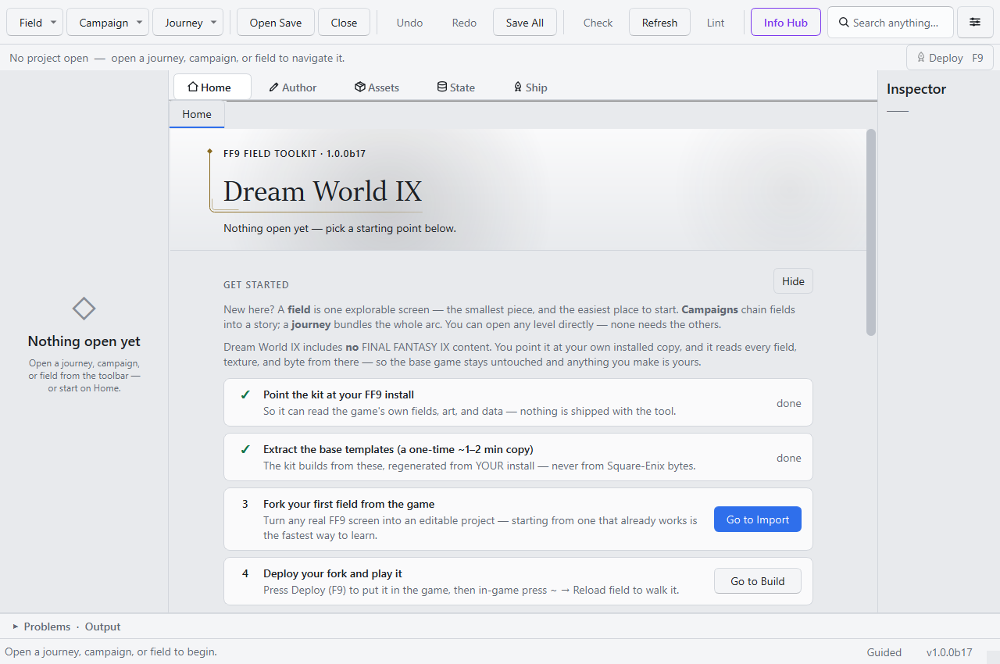
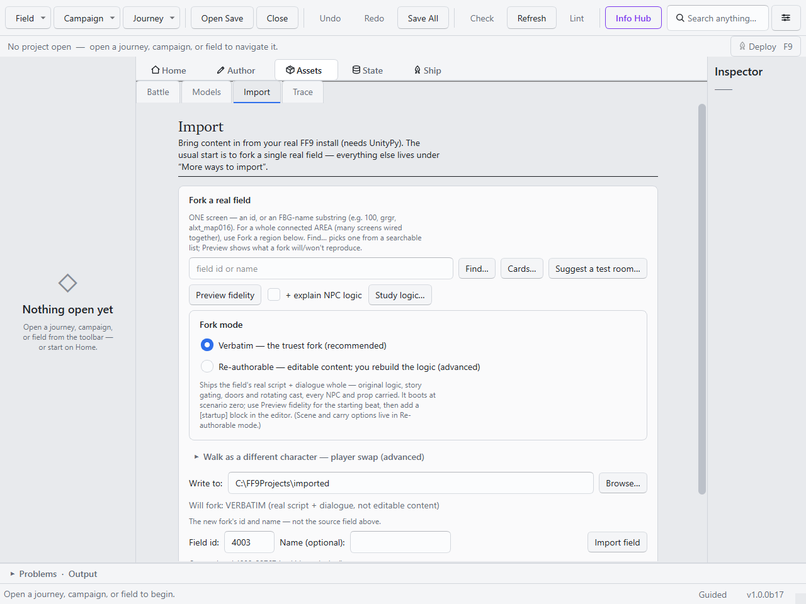
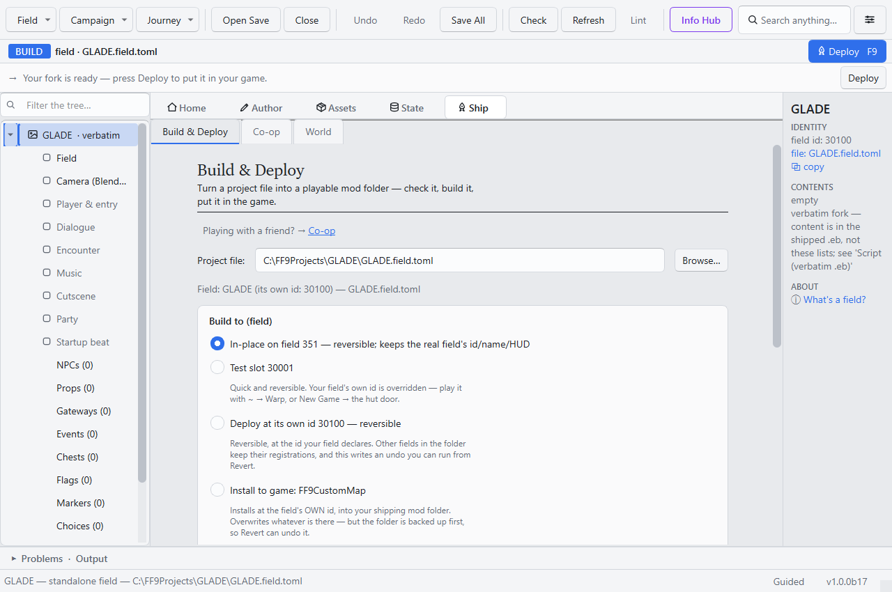

# S1 — Stand in the game

```toml
[tutorial]
track = "S"
step = 1
goal = "Fork a real FF9 room, deploy it under your own id, and walk it in the game."
requires = ["game", "gui", "assets"]

[[tutorial.ui]]
label = "Suggest a test room…"
widget = "import_field.rooms_btn"

[[tutorial.ui]]
label = "Preview fidelity"
widget = "import_field.preview_btn"

[[tutorial.ui]]
label = "Import field"
widget = "import_field.import_btn"
```

The first step of the spine: by the end, FINAL FANTASY IX loads a field that belongs to your mod,
under your own id, and your party walks it. Every later tutorial builds on the room made here.

The whole spine works inside the **Workspace** — the desktop GUI. One thing to know up front: the
Workspace is a front-end over the same engine as the `ff9mapkit` command line. Every action it
runs streams into the Output console at the bottom, and everything here has a terminal twin —
the [CLI track](../../../SETUP.md#7-cli-command-reference) picks that thread up later.

**Starting from:** a set-up toolkit ([Setup](../../../SETUP.md) §1–§3). Launch the Workspace:
`ff9mapkit-workspace` (installed copy) or `py apps\ff9_workspace.pyw` (repo checkout).

## 1. Green lights on Home

The **Home** tab is the setup checklist. The first two rows — game install found, base templates
extracted — must show done; fix them from the Setup & Health dialog if not (the toolkit ships no
Square Enix data; templates are derived from your own install, once).



## 2. Fork a room

A *fork* copies one real FF9 screen — art, walkable floor, camera — into an editable project.



1. Open the **Assets ▸ Import** tab.
2. Click **Suggest a test room…** and take a suggestion — they are vetted starters (small, no
   story machinery in the way). Donor names and ids both work in the field box (①).
3. **Preview fidelity** (②) shows what the fork will and won't reproduce, before anything is
   written.
4. Leave **Fork mode** on Verbatim (③) — the truest copy — pick an output folder under
   **Write to:**, and click **Import field** (④).

The forked project opens in the left-hand tree.

## 3. Put it in the game



Open **Ship ▸ Build & Deploy**. For a first fork the two routes that matter:

- **In-place on the real field** (①) — your fork replaces the donor room in-game, reachable the
  normal way. Reversible; pre-selected for a verbatim fork.
- **Test slot** (②) — a throwaway scratch id, the fast lane used from here on.

Press **Deploy** (or **F9**). The Output console shows the build; the first deploy of a new id
needs one game relaunch (it registers the id) — after that, never again.

## 4. Walk it

In the game, press **~** (tilde) to open the debug menu → **Warp to field** → your id (an
in-place deploy needs no warp — just enter the room normally). The field renders, the party
walks the same floor the original did.

**What you should see:** your room, your id, your party standing in it. If the screen is black,
the id was never registered — relaunch once, and see
[Troubleshooting](../TROUBLESHOOTING.md) for the rest.

## Next

- [S2 — Someone lives here](s2-someone-lives-here.md): give the room a resident and learn the
  edit → deploy → reload loop.
- What a fork actually carries: [fork fidelity](../FORK_FIDELITY.md).
