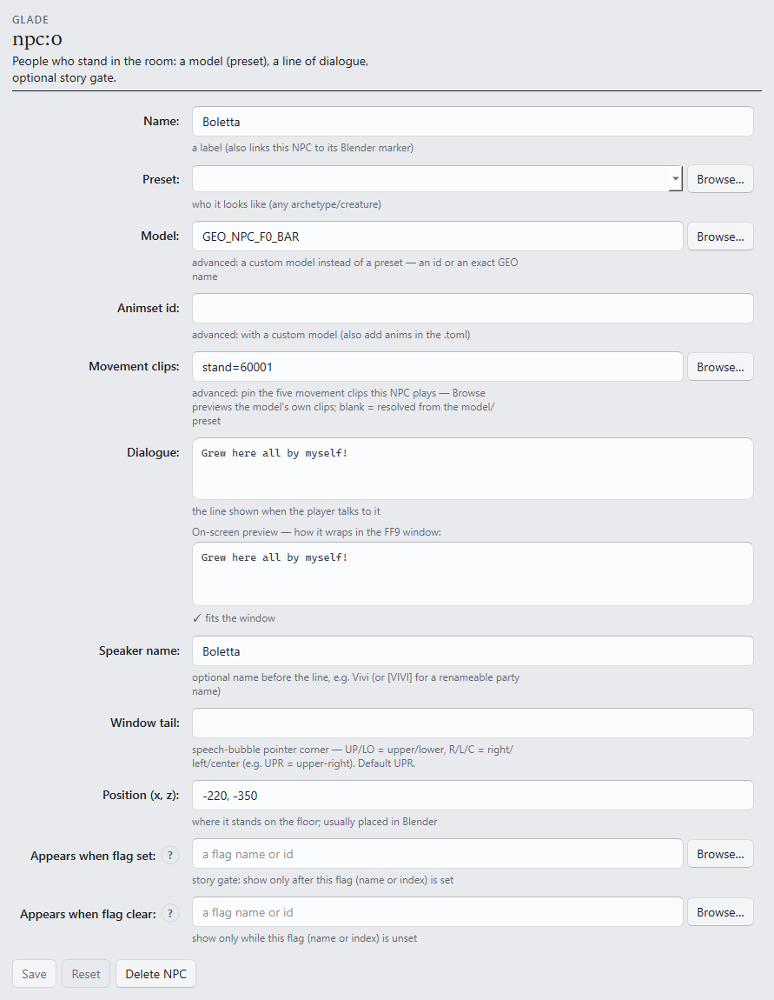

# S2 — Add an NPC and dialogue

```toml
[tutorial]
track = "S"
step = 2
builds_on = ["s1-fork-and-deploy"]
goal = "Add an NPC with your own dialogue line, and learn the edit → deploy → reload loop."
requires = ["game", "gui", "assets"]

[[tutorial.ui]]
label = "Name"
widget = "form:npc.name"

[[tutorial.ui]]
label = "Preset"
widget = "form:npc.preset"

[[tutorial.ui]]
label = "Dialogue"
widget = "form:npc.dialogue"

[[tutorial.ui]]
label = "Position (x, z)"
widget = "form:npc.pos"

[[tutorial.ui]]
label = "Appears when flag set"
widget = "form:npc.requires_flag"
```

The room from S1 is empty. This step adds an NPC with a dialogue line, and teaches the loop
every later step runs on: change one thing, deploy, reload in-game, look.

**Starting from:** the S1 fork open in the Workspace. To recreate it: **Assets ▸ Import** →
**Suggest a test room…** → **Import field** ([S1](s1-fork-and-deploy.md)).

## 1. Add the NPC

Select the field's node in the left-hand tree → the **Editor** tab shows its forms. Open the
**NPCs** section and add an entry:



- **Name** — any label; it names the entry in the tree.
- **Preset** — which model it uses; **Browse…** opens the catalog with portraits.
- **Dialogue** — the line spoken on talk. The preview under the box renders it in FF9's real
  window geometry, so overflow is visible *before* the game shows it.
- **Position (x, z)** — where it stands. The Inspector on the right shows the field art with its
  walkable bounds; a position outside the mesh gets a lint finding, not a silent no-show.
- **Appears when flag set** — gates the NPC behind a story flag. Leave it blank for now;
  [S4](s4-story-flags.md) uses this control.

**Ctrl-S** saves. The **Problems** console (bottom) lints live — a clean save here is the
offline half of the verification, no more: offline checks never replace looking at the game.

## 2. Deploy and look

**Ship ▸ Build & Deploy** → **Deploy** (**F9** does save-all + deploy in one press). In the
game: **~ → Reload field**. No relaunch — the id is already registered from S1.

**What you should see:** the NPC standing at the chosen spot; talking to it opens your line,
wrapped exactly as the preview showed.

## 3. The development loop

That was the whole cycle: **edit → Deploy (F9) → ~ Reload → look.** Two rules make it reliable:

- **One change per reload.** When something breaks, the last edit is the suspect — a batch of
  edits has no suspect.
- **The status bar tracks drift.** The `game: in sync` / `game: N ahead` chip says whether the
  running game matches the open project; the change list behind it answers "what did I change
  since the last deploy?"

## Next

- [S3 — Connect two fields with gateways](s3-gateways.md).
- Every NPC key this step skipped: [`[[npc]]` in the reference](../FORMAT.md#npc-optional-repeatable).
