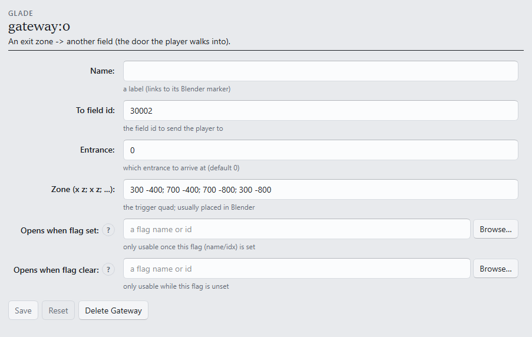

# S3 — A door of your own

```toml
[tutorial]
track = "S"
step = 3
builds_on = ["s2-someone-lives-here"]
goal = "Fork a second room and connect the two with gateways, both directions."
requires = ["game", "gui", "assets"]
```

One room is a diorama; two rooms with doors are a place. This step forks a second room and wires
walk-through exits between them.

**Starting from:** the S1/S2 room, deployed. To mint fresh: fork any vetted room
(**Suggest a test room…**) and deploy it ([S1](s1-stand-in-the-game.md)).

## 1. A second room

Repeat the S1 fork — **Assets ▸ Import**, another suggestion or any donor — into its own folder,
and give it a **different id** on the Build tab when deploying (every deployed field needs its own
id; the engine's registry is global). Deploy it once and note both ids — say `30001` and `30002`.

## 2. The door out

Open the first room in the Editor and add an entry under **Gateways**:



- **To field id** — the destination (`30002`).
- **Zone** — four `x z` corner pairs of the region the player walks into, placed at the doorway
  on the walkable floor. Order matters one way: the **first edge is the walk-out direction** —
  put the zone's front edge (the one the player crosses) first.
- **Entrance** — which arrival spot in the destination to appear at; `0` (the default) is the
  field's own default arrival. Per-door arrival spots are
  [`[[player.arrival]]`](../FORMAT.md#playerarrival-optional-repeatable--per-door-arrival-spots)
  when one door needs its own landing.

**Ctrl-S**, deploy, **~ → Reload field**, and walk into the zone.

**What you should see:** a fade, then the second room, with the party standing at its arrival
spot.

## 3. The door back

Same form in the second room, pointing at the first (`to = 30001`). Deploy, reload, and walk the
loop both ways.

A gateway can also be drawn directly on the field art with the **Author ▸ Place** tab's Regions
tool — the visual route, covered in the click-authoring track. And the same form's
**Opens when flag set** field can lock a door until the story says otherwise — which is exactly
where the spine goes next.

## Next

- [S4 — The world remembers](s4-the-world-remembers.md): a chest, a flag, and an NPC who only
  shows up afterwards.
- Every gateway key (including world-map exits): [`[[gateway]]` in the reference](../FORMAT.md#gateway-optional-repeatable).
