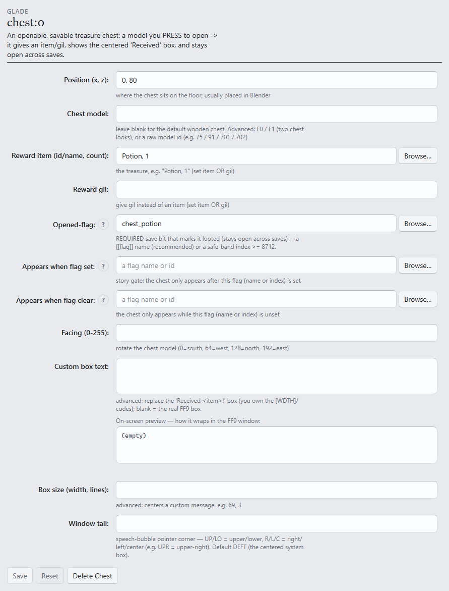

# S4 — Story flags: a chest and a gated NPC

```toml
[tutorial]
track = "S"
step = 4
builds_on = ["s3-gateways"]
goal = "A treasure chest that stays looted across saves, and an NPC who appears only after it."
requires = ["game", "gui", "assets"]

[[tutorial.ui]]
label = "Position (x, z)"
widget = "form:chest.pos"

[[tutorial.ui]]
label = "Reward item (id/name, count)"
widget = "form:chest.item"

[[tutorial.ui]]
label = "Reward gil"
widget = "form:chest.gil"

[[tutorial.ui]]
label = "Opened-flag"
widget = "form:chest.flag"

[[tutorial.ui]]
label = "Name"
widget = "form:flag.name"

[[tutorial.ui]]
label = "gEventGlobal bit"
widget = "form:flag.index"

[[tutorial.ui]]
label = "Appears when flag set"
widget = "form:npc.requires_flag"

[[tutorial.ui]]
label = "Opens when flag set"
widget = "form:gateway.requires_flag"

[[tutorial.ui]]
label = "Suggest a test room…"
widget = "import_field.rooms_btn"

[[tutorial.ui]]
label = "Import field"
widget = "import_field.import_btn"
```

A **story flag** is one save-backed bit that something sets and other content reads. It is the
mechanism persistent state runs on: loot a chest → an NPC appears; pull a lever → a door
unlocks. This step builds the first pair.

**Starting from:** the S3 pair, continuing the build — though this step itself needs only one
deployed room. To recreate that cold: fork any vetted room (**Assets ▸ Import** →
**Suggest a test room…** → **Import field**) and deploy it to the Test slot
([S1](s1-fork-and-deploy.md)). One caution about cold starts, for this and every later step:
[S7](s7-package-a-campaign.md) packages the *connected pair* into the campaign, so a fresh room
made just for one step is a side build — fine for practice, not part of the finished mod.

## 1. Add a chest

In the Editor, add a **Chest** entry — an openable chest model with solid collision, the lid
animation, and FF9's centered *"Received …!"* box:



- **Position (x, z)** — on the walkable floor, reachable to press.
- **Reward item (id/name, count)** — the treasure, by name (`Potion, 1`) or id; or
  **Reward gil** instead.
- **Opened-flag** — REQUIRED: the save bit that records the loot. Use a **named flag**: add a
  **Flag** entry (**Name** `chest_potion`, **gEventGlobal bit** `8720`) and put the name here.
  Indices must sit in the **safe band `[8712, 16320)`** — lower bands belong to the real game's
  save data, and the lint refuses them.

## 2. Gate an NPC on the flag

On an **NPC** entry (new or the S2 one), set **Appears when flag set** to `chest_potion` — the
same field visible in the NPC form from S2. Give the NPC a line that acknowledges the loot.

That is the whole producer/consumer pattern: the chest *sets* the bit, the NPC *reads* it. The
**Check** button (and Problems) lints the pair — a gate no producer ever sets is reported as
dead content before the game ever runs.

## 3. Verify persistence

Deploy, reload, then:

1. Check the spot where the gated NPC should be — absent.
2. Open the chest: lid animation, *"Received Potion!"*, and the NPC now appears.
3. Press the chest again — it stays open, no second reward.
4. **Save, reload the save.** The chest is still open; the NPC is still there.

**What you should see:** step 4 is the point — the state persists in the save file, not the
field.

Locked doors are the same mechanism on the S3 form: a gateway's **Opens when flag set** holds
the exit shut until the bit is set. Invisible walk-over triggers (a message zone, a pickup
without a chest model) are the [`[[event]]`](../FORMAT.md#event-optional-repeatable) form —
same flags, no model.

## Next

- [S5 — A cutscene and music](s5-cutscene-and-music.md).
- The full flag reference (bands, naming, campaign-wide flags):
  [story flags & branching](../FORMAT.md#story-flags--branching).
