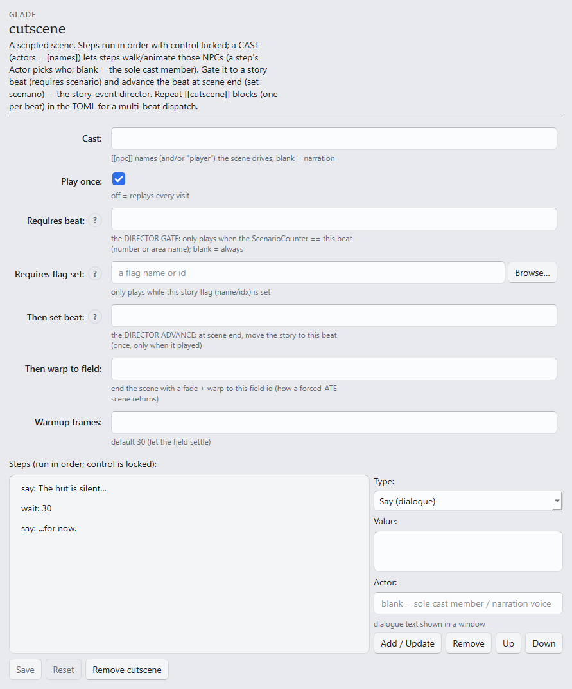

# S5 — Lights, camera

```toml
[tutorial]
track = "S"
step = 5
builds_on = ["s4-the-world-remembers"]
goal = "An entry cutscene that plays once, over a music pick of your own."
requires = ["game", "gui", "assets"]
```

The rooms have space and memory; now they get staging. A **cutscene** is the one thing the other
forms can't express — steps that run *in order*, with player control locked while they do.

**Starting from:** any room of the S3/S4 pair.

## 1. A scene on entry

In the Editor, open the **Cutscene** section:



Build a three-step narration with the step editor on the right — pick a **Type**, fill
**Value**, press **Add / Update**:

1. **Say (dialogue)** — the line; a window that blocks until dismissed,
2. a wait — a pause in frames (30 ≈ one second),
3. another **Say (dialogue)**.

Leave **Play once** checked: the scene plays a single time ever (a save-persistent flag guards
it — the same memory mechanism as S4's chest, allocated automatically). Control locks for the
duration on its own.

Deploy, **~ → Reload**, walk in. **What you should see:** the party freezes, the lines play in
order, control returns — and a second visit stays quiet (the `once` flag at work; to watch it
again during authoring, deploy again and reload — a redeploy starts the field's state fresh in
the scratch slot).

A scene can also *drive a cast* — walk the S2 resident around, turn, emote, speak — by naming
it under **Cast**; and gated to story beats (**Requires beat** / **Then set beat**) it becomes
FF9's own story-event director. Both live in
[`[cutscene]` in the reference](../FORMAT.md#cutscene--cutscene-optional) when the spine's
basics are done.

## 2. Your own soundtrack

The **Music** section scores the room:

- **Song id** — pick any of FF9's tracks (Browse… lists them by name). Plays on entry and
  resumes after battles. Hot-reloads with the normal loop.
- **Your own audio file** — a wav/mp3/ogg path; the build transcodes it and mints a brand-new
  song id into the mod. One honesty note: custom audio loads at game **startup**, so this one
  needs a full game restart to hear — ~ reload is not enough.

Deploy, reload (or restart for a custom file). **What you should see** — hear: your pick under
your scene.

## Next

- [S6 — Danger](s6-danger.md): random encounters in your field, and picking what they are.
- Every step kind, cast scenes, ATEs, the story director:
  [`[cutscene]`](../FORMAT.md#cutscene--cutscene-optional) · [`[music]`](../FORMAT.md#music-optional).
