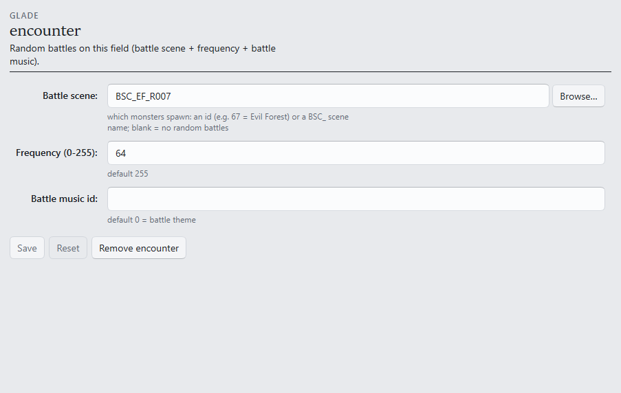

# S6 — Random encounters

```toml
[tutorial]
track = "S"
step = 6
builds_on = ["s5-cutscene-and-music"]
goal = "Random battles in your field — choose what spawns and how often, and win one."
requires = ["game", "gui", "assets"]
```

This step arms random encounters, using the weakest battle pool in the game so a starter party
can win.

**Starting from:** any deployed room of the pair.

## 1. Arm the field

In the Editor, open the **Encounter** section:



- **Battle scene** — which monsters spawn: an id or a `BSC_` name; **Browse…** lists them.
  `BSC_EF_R007` is Evil Forest's pool — the first and weakest battles in FF9.
- **Frequency (0-255)** — how often walking triggers a battle. The default 255 triggers very
  often; `64` is a low rate.
- **Battle music id** — blank keeps the normal battle theme.

One thing the form does silently but is worth knowing: adding an encounter also adds the
**after-battle re-entry handler** the field needs. Without one, a field freezes when the battle
returns — the kit wires it automatically.

## 2. Verify in-game

Deploy, **~ → Reload**, and walk. **What you should see:** within a stretch of walking, a battle
starts against Evil Forest monsters; win it, and the party returns to the room, walkable, with
the field music resumed (S5's pick included).

If battles trigger too often or too rarely, adjust **Frequency** — one change, one deploy, one
walk: the S2 loop.

## Next

- [S7 — Package a campaign](s7-package-a-campaign.md).
- Scene pools, per-scene boss music, battle tuning: [`[encounter]`](../FORMAT.md#encounter-optional)
  · [`[[battle_bgm]]`](../FORMAT.md#battle_bgm-optional-array-of-tables) ·
  [BATTLE_DESIGN.md](../BATTLE_DESIGN.md).
