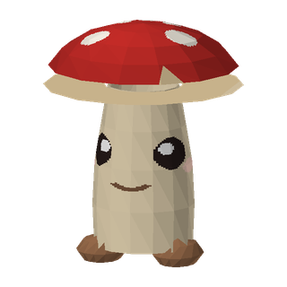

# Example: Boletta — a creature from scratch



A wholly-original creature with **zero FF9-derived bytes**: her mesh, rig, skin weights, texture,
and idle animation are all generated by plain Python in this folder, then shipped through the same
pipeline an edited real model uses. In-game-proven 2026-07-08 (renders, idles on her own clip,
talks).

```
make_creature.py        the mesh + 5-bone rig + weights + PIL-painted texture -> creature/6300.fbx
make_creature_anims.py  her 2-second idle bob, authored from curves -> a minted 16-bit anim key
boletta.field.toml      a minimal field that mints her GEO id (6300) and places her as an [[npc]]
```

Run order is in the toml's header comment. The full walkthrough — including the two calibration
lessons (triangle winding, texture-V orientation) and the deploy-revert caveat — is tutorial
[12-creature-from-scratch](../../docs/tutorials/12-creature-from-scratch.md).

This example doubles as the reference for authoring **any** from-scratch model: the Model-struct
shape, the Y-down model space, the one-merged-mesh rule, and the preview-before-deploy loop are
all in `make_creature.py`'s comments. If you'd rather sculpt in Blender than in Python, export any
model with `model-gltf`, replace the geometry wholesale, and come back through `model-import` —
the mint + animset steps are identical from there.
