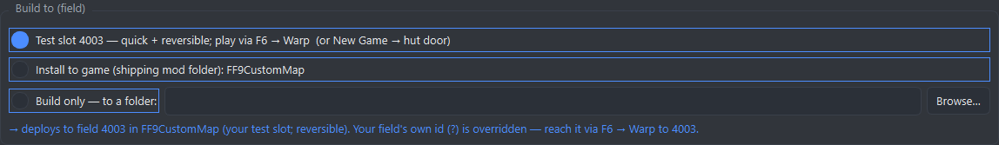
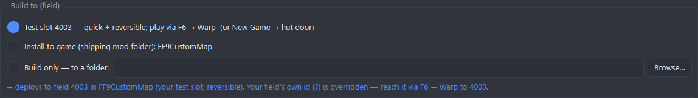

# Workspace GUI, round 2 — **aesthetics**

The [gui-makeover](../gui-makeover/) study (2026-07-14) shipped 10 phases: semantic role tokens, an elevation
ladder, WCAG AA contrast, focus rings, 24px targets, screen-reader names, an SVG icon family, teaching
empty-states, disclosure drawers, motion with a reduced-motion gate. It succeeded **on its own terms** — but
every one of those phases optimized *usability*. None asked "does this look good". So finishing them did not
make the app look good, and the user's verdict after the fact was: *"the cards don't read well… I want the GUI
to be beautiful to look at. I don't have a clear vision for how to proceed."*

This round asks only the aesthetic question. Research pass, 2026-07-15 — a plan, not implementation.

- **[PLAN.md](PLAN.md)** — the deliverable: the diagnosis, the named direction + three laws, a gated first
  spike, 7 phases (P0–P6) with file:line changes / token diffs / tests / an explicit *"you'll see:"* per phase,
  a **Rejected** table, and 5 open questions with recommendations.
- **[VISION.md](VISION.md)** — the art direction (**WORKSHOP**), synthesized across the 10 lenses.
- **[CRITIC.md](CRITIC.md)** — the adversarial rebuttal. **The most load-bearing of the three**: it reframed
  the plan by catching that the vision's headline was a 27-site refactor justified by a screenshot containing
  a one-line bug.
- **[evidence/](evidence/)** — runnable proof of the headline finding:
  - `prove_radio_border.py` — the pixel proof (colour-only, so offscreen-safe). Exits non-zero if it stops reproducing.
  - `shot_builddeploy.py` — renders the real panel before/after on the **native** platform → the two PNGs below.

## The headline

**The screenshot is a bug, not a design failure.** [`style.py:126`](../../ff9mapkit/ff9mapkit/workspace/style.py#L126)
writes the pseudo-class before the pseudo-element:

```
QCheckBox:focus::indicator, QRadioButton:focus::indicator { border: 1px solid $focus; }
```

Qt does not reject this — it degrades to an unconditional `QRadioButton, QCheckBox { border: 1px solid $focus }`.
Every radio and checkbox in the app wears a permanent accent rectangle, and radios have had **no focus ring at
all** since the rule landed (the a11y test greps selector strings, so it passes regardless). Reorder to
`::indicator:focus`. One line.

Reproduce: `py studies/gui-aesthetics/evidence/prove_radio_border.py` → an unfocused, unchecked radio paints
`#4c8dff` on **4/4** edges before, **0/4** after.

The same panel, one selector reordered, **nothing else changed**:

| before | after |
|---|---|
|  |  |

**Nobody in the dossier looked at the panel without those rects** — the vision's headline ("kill all 27
QGroupBoxes") is a 27-site refactor across 7 files justified by *this* image. So the plan's order is: fix the
line, re-screenshot, *then* decide whether the boxes were ever the problem.

The "after" shot also earns Step 2 on sight: with the rects gone, the blue `role="accent"` paragraph is
plainly the loudest object on the card and the least important thing on it. (It is also *sub-AA as text in 6
of 7 palettes* — the aesthetic move and the accessibility fix are the same move.)

## The diagnosis, in one line

A complete design system exists and the app doesn't use it. `role="h1"` is set by nothing; `widgets.card()`,
`heading()`, `status_chip()`, `tabular()` have **zero call sites**; `space_1/3/4/6` are dead; `font-weight: 500`
resolves to Regular (Segoe UI ships no Medium). Every mechanism that could rank things was built, tokenized,
tested — and never spent, leaving one instrument: draw a 1px rectangle around it. **A rectangle cannot rank.**

## Method

90 agents: 3 recon (tokens · containers · constraints) → 10 independent design lenses (hierarchy, typography,
colour, space, components, identity, IA, craft, benchmark, motion) → per-proposal adversarial review → vision →
completeness critic → plan. **74 proposals reviewed; all 74 returned NEEDS_REVISION** — zero survived as first
drafted. Everything in the plan is a corrected proposal; the refuted set is preserved in **Rejected** so it
isn't re-proposed.

## ⚠ Harness warning — the trap this round fell into

`QT_QPA_PLATFORM=offscreen` **stubs the Qt font database and inflates every text advance 2–3×.**

[gui-makeover/README.md](../gui-makeover/README.md) already documented this ("that gives tofu boxes") and the
lenses fell into it anyway: the widest control in the app is **642px**, not the 1503px the dossier claimed, and
at 1280px there is ~1080px of content. **There is no horizontal-scroll emergency and there never was** — every
"collapse the tab's minimum width" argument is dead, and the padding amputation at `style.py:152-153` is
defended by a bug that may never have been real at that magnitude.

The rule, stated precisely enough to be useful:

> **Measure the pixels — and know which pixels your harness is lying about.**
> **Colour** is font-independent → offscreen renders are trustworthy (this is why the radio-border proof holds).
> **Width/geometry** is font-dependent → offscreen renders are fiction. Use the native platform +
> `WA_DontShowOnScreen` recipe from [gui-makeover/README.md](../gui-makeover/README.md).

Any width assertion added to CI needs `skipif "Segoe UI" not in QFontDatabase.families()` or it locks in the artifact.

## Two live bugs found en route

Both predate this round and neither is caught by the suite:

1. **`style.py:126`** — the unconditional radio/checkbox border above; radios have never had a focus ring.
2. **`muted` on `surface_2` is sub-AA today** — 3.87–4.07 in NORD / DRACULA / SOLARIZED-DARK / GRUVBOX. Uncaught
   because the contrast test only ever checks `bg` and `surface`. Any caption placed inside a QGroupBox lands on
   this untested surface, so **the assertion ships before the captions do** (Phase 0).
